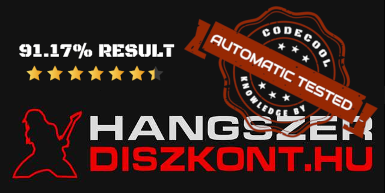
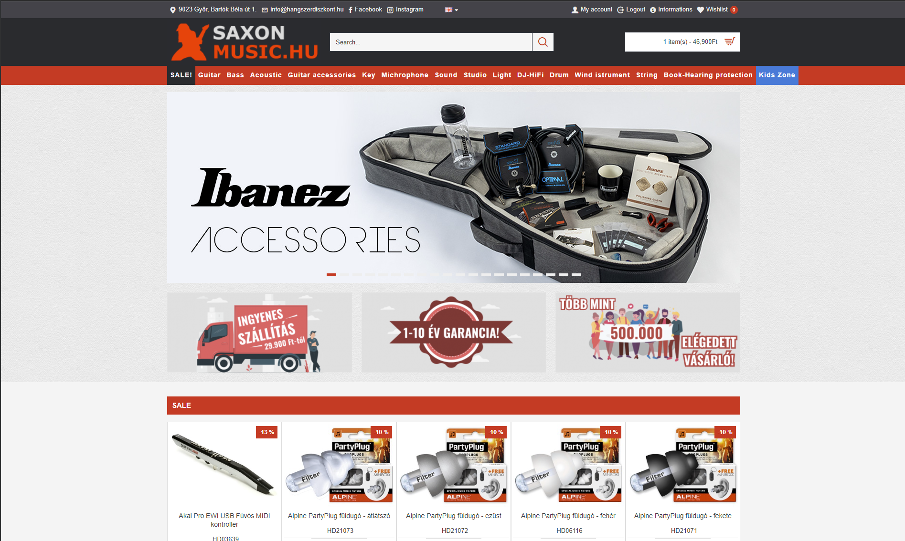
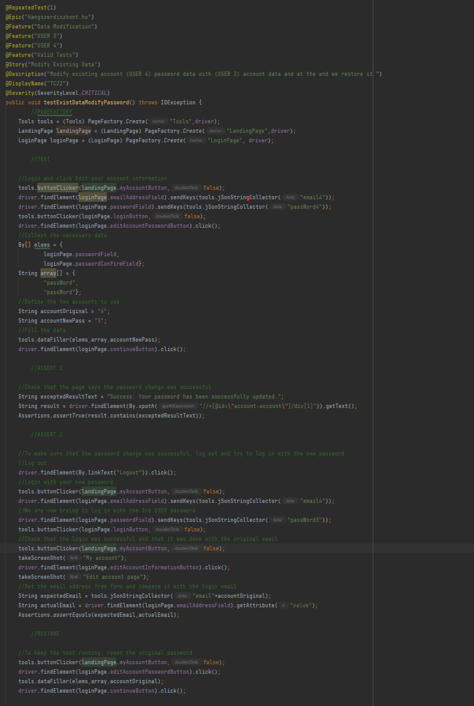

<div id="top"></div>
<!--
*** Thanks for checking out the Best-README-Template. If you have a suggestion
*** that would make this better, please fork the repo and create a pull request
*** or simply open an issue with the tag "enhancement".
*** Don't forget to give the project a star!
*** Thanks again! Now go create something AMAZING! :D
-->


<!-- PROJECT SHIELDS -->
<!--
*** I'm using markdown "reference style" links for readability.
*** Reference links are enclosed in brackets [ ] instead of parentheses ( ).
*** See the bottom of this document for the declaration of the reference variables
*** for contributors-url, forks-url, etc. This is an optional, concise syntax you may use.
*** https://www.markdownguide.org/basic-syntax/#reference-style-links
-->
[![Contributors][contributors-shield]][contributors-url]


[![LinkedIn][linkedin-shield]][linkedin-url]


<!-- PROJECT LOGO -->
<br />
<div align="center">
  <a href="https://github.com/github_username/repo_name">
    
  </a>

<h3 align="center">CodeCool Exam Project</h3>

  <p align="center">
    <a href="https://hangszerdiszkont.hu"><strong>www.hangszerdiszkont.hu</strong></a>
    <br />
    <br />
    <a href="https://github.com/R0land90/CodeCoolFinalExamProject#readme"><strong>Explore the docs »</strong></a>
    <br />
    <br />
    <a href="https://github.com/R0land90/CodeCoolFinalExamProject#readme"><strong>View Test Manager file »</strong></a>
    <br />
    <br />
    <a href="https://r0land90.github.io/CodeCoolFinalExamProject/20/"><strong>View Allure Report</strong></a>
    <br />
    <br />
    <a href="https://github.com/R0land90/CodeCoolFinalExamProject/issues">Report Bug</a>
    ·
    <a href="https://github.com/R0land90/CodeCoolFinalExamProject/issues">Request Test</a>
  </p>
</div>


<!-- TABLE OF CONTENTS -->
<details>
  <summary>Table of Contents</summary>
  <ol>
    <li>
      <a href="#about-the-project">About The Project</a>
      <ul>
        <li><a href="#built-with">Built With</a></li>
      </ul>
    </li>
    <li>
      <a href="#getting-started">Getting Started</a>
      <ul>
        <li><a href="#prerequisites">Prerequisites</a></li>
        <li><a href="#installation">Installation</a></li>
      </ul>
    </li>
    <li><a href="#usage">Usage</a></li>
    <li><a href="#contributing">Contributing</a></li>
    <li><a href="#contact">Contact</a></li>
    <li><a href="#acknowledgments">Acknowledgments</a></li>
  </ol>
</details>


<!-- ABOUT THE PROJECT -->
## About The Project

<div align="center">
  <a href="https://hangszerdiszkont.hu">
    
  </a>

My Codecool studies eventually led to this project. My exam was to automation test a site of my choice based on certain predefined criteria. My choice was an online webshop that deals with products that are close to my personal interests, musical instruments.
The predefined criteria were as follows: <br /> <br />  `Registration`, `Login`, `Privacy Policy`, `Listing of Data`, `Multi-page List`, `New data input`, `Modify existing data`, `Delete data`, `Save data`, `Logout`

<p align="right">(<a href="#top">back to top</a>)</p>


### Built With
 <br />

* [IntelliJ IDEA](https://www.jetbrains.com/)
* [Selenium WebDriver](https://www.selenium.dev/)
* [Allure Report](https://qameta.io/allure-report/)
* [JUnit 5](https://junit.org/junit5/)
* [Maven Repository](https://mvnrepository.com/)
* [Java SE](https://www.oracle.com/java/)
* [JSON](https://www.json.org/json-en.html)
* [GitHub](https://github.com/)

<p align="right">(<a href="#top">back to top</a>)</p>


<!-- GETTING STARTED -->
## Getting Started

To be able to run the tests ourselves, we need some preparation and conditions.

### Prerequisites

Let's start with the IDE, which in our case is highly recommended IntelliJ IDEA 2022.1.1
<br />
For Java, you will need Java SE version 16. Install that too.

### Installation

1. First step is to clone the repo
 
   ```sh
   git clone git@github.com:R0land90/CodeCoolFinalExamProject.git
   ```
2. Start the IntelliJ IDE
3. Open the cloned repository on IntelliJ as a project.
4. In the project settings, check that Java version 16 is set, the dependencies of my tests are set to this version. Errors may occur on other versions.
5. Load the necessary tools in the `pom.xml` file.


<p align="right">(<a href="#top">back to top</a>)</p>


<!-- USAGE EXAMPLES -->
## Usage
Tests are organised into test classes with a clear name. Tests can be run from these classes.

My tests have detailed commentary and clear structuring to help you find your way around.

The test is started by building and running the test method

<div align="center">
  <a href="https://hangszerdiszkont.hu">
    
  </a>

_For more screenshots and statistics, please refer to the [Allure Report](https://r0land90.github.io/CodeCoolFinalExamProject/20/)_

<p align="right">(<a href="#top">back to top</a>)</p>


## Conclusion
The automated tests were successfully completed and all criteria were met:<br /><br />

- [x] Requirements fulfilled
- [x] Test Manager file filled in [Open File](https://docs.google.com/spreadsheets/d/1UBBZAuH0J5V6GjJOi3nL8mq-TLWs1g8t2Musju8R_m4/edit?usp=sharing)
- [x] Allure Report completed [Open Report](https://r0land90.github.io/CodeCoolFinalExamProject/20/)
- [x] Every `git push` results in a new, updated Allure Report <br /><br />


Manual steps for automated tests documented in the Test Manager.xlsx file

For repetitive and more general tasks, I created a set of tools in a class called `tools`. [Open tools](https://github.com/R0land90/CodeCoolFinalExamProject/blob/main/src/main/java/Tools.java)

The `Repeated and serial data entry from data sources` criterion was implemented in several tasks. These can be found in the tasks `Register`, `Login`, `Modify Existing Data` and `Save Data`. The external files are in JSON format and I used JSON tools to write and read them.

If you have any comments or bugs, please use the github issue
[Open issues](https://github.com/R0land90/CodeCoolFinalExamProject/issues)

<p align="right">(<a href="#top">back to top</a>)</p>


<!-- CONTACT -->
## Contact

Crisan Roland - [LinkedIn](https://www.linkedin.com/in/roland-crisan-9729b554/) - roland.crfl@gmail.com

Project Link: [https://github.com/R0land90/CodeCoolFinalExamProject](https://github.com/R0land90/CodeCoolFinalExamProject)

<p align="right">(<a href="#top">back to top</a>)</p>


<!-- ACKNOWLEDGMENTS -->
## Acknowledgments

* My Codecool mentors, especially Tamás who patiently taught us all the time
* To my group mates, for all their learning together and their helpfulness
* And for the opportunity to be part of this year-long journey.

<p align="right">(<a href="#top">back to top</a>)</p>


<!-- MARKDOWN LINKS & IMAGES -->
<!-- https://www.markdownguide.org/basic-syntax/#reference-style-links -->
[contributors-shield]: https://img.shields.io/badge/TEST_STATUS-91.17-green?style=for-the-badge
[contributors-url]: https://github.com/github_username/repo_name/graphs/contributors
[forks-shield]: https://img.shields.io/github/forks/github_username/repo_name.svg?style=for-the-badge
[forks-url]: https://github.com/github_username/repo_name/network/members
[issues-shield]: https://img.shields.io/github/issues/github_username/repo_name.svg?style=for-the-badge
[issues-url]: https://github.com/github_username/repo_name/issues
[linkedin-shield]: https://img.shields.io/badge/-LinkedIn-black.svg?style=for-the-badge&logo=linkedin&colorB=555
[linkedin-url]: https://www.linkedin.com/in/roland-crisan-9729b554/
[product-screenshot]: images/screenshot.png
